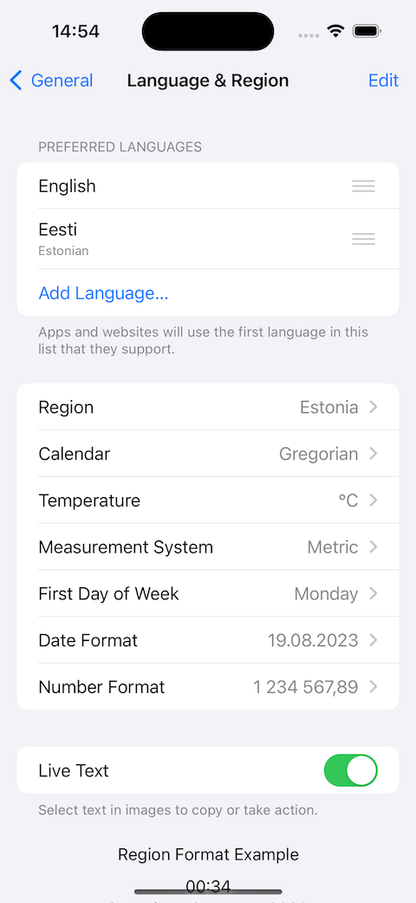

#  PackageStringsBug

This repo demonstrates a bug in how NSLocalizedString does not load the expected localized string in the context of a SwiftUI preview or snapshot test, but does work as expected when running in the context of a final app.

## Expected behavior

The expected behavior is shown when you run the full app on simulator or device. The strings shown in the UI depend on the preferred language set in the device.

Here is what the device settings look like when using Estonian as the preferred language, and what the app screens should look like.

  

When you set the language to English, here are the corresponding views.

  

So far, so good

## Observed broken behavior with tests and previews

Here’s what you see with both SwiftUI previews and snapshot tests.

SwiftUI `Text` API loads the correct localization as expected. However, `NSLocalizedString` does not consider the locale that is passed in with SwiftUI environment, and loads the incorrect string.

The incorrect behavior is the same in main app target and package, and is similarly broken in both SwiftUI previews and snapshot tests.

My expectation is that in the context of SwiftUI, either NSLocalizedString should work correctly, or there should be another API to load the correct localized string from the strings file, to do manipulation on it as needed. E.g imagine that NavigationTitle wasn’t a static string, but actually contained variables, and I would need to substitute those before passing it on to the navigation title API.

Filed to Apple as FB12146083.
